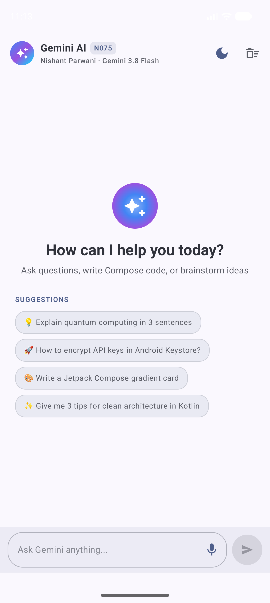
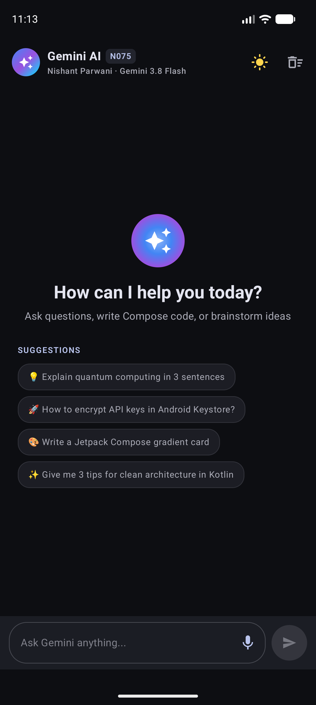
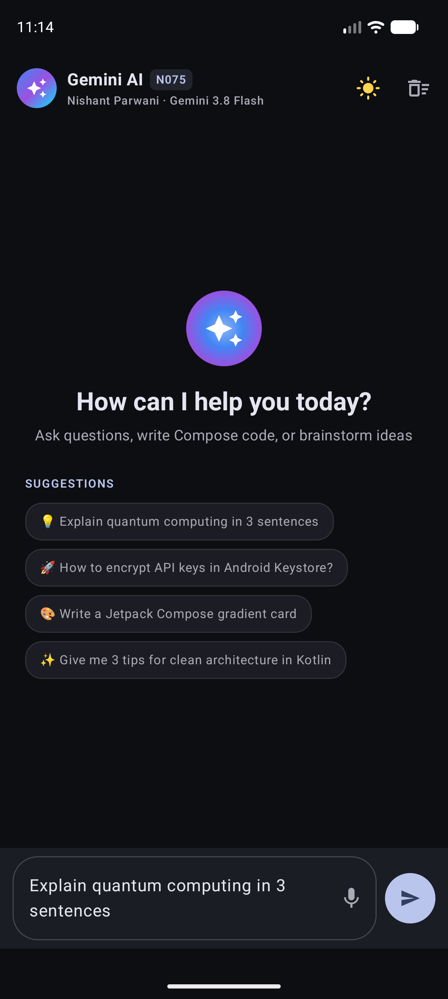
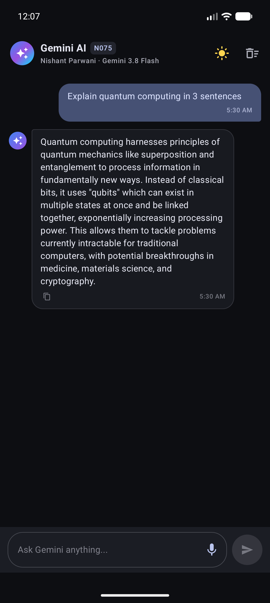
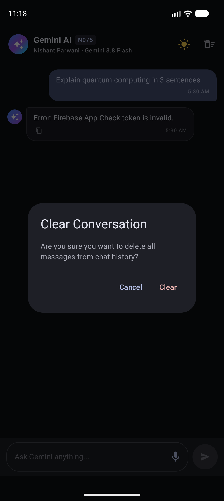

# N075nishantassgn1 — Gemini Jetpack Compose Chat Application

**Student:** Nishant Parwani  
**Roll No.:** N075  
**Program:** MBA Tech Computer Engineering  
**Application ID:** `com.example.n075nishantassgn1`  
**Branch:** `N075-gemini-chat`

---

## App Screenshots & UI Showcase

### 1. Light Mode & Dark Mode (1-Tap Switch)
| Light Mode | Dark Mode |
|:---:|:---:|
|  |  |

### 2. Interaction Flow & Conversation Management
| Suggestion Prompt Tapped | Gemini Response Card | Clear History Dialog |
|:---:|:---:|:---:|
|  |  |  |

---

## 1. Project Overview & Features

This project is a feature-rich, beautifully designed Gemini-powered Android chat application built from the ground up using modern Android architecture with **Kotlin** and **Jetpack Compose (Material 3)**.

### Key Features Implemented:
- **Aesthetic Material 3 Interface**: AI gradient emblem, Roll No. badge (`N075`), modern pill chat bubbles, bold markdown text rendering, and timestamps.
- **Dynamic Light & Dark Theme**: One-tap Sun/Moon toggle icon button in the `TopAppBar`, instantly saved and restored using **Preferences DataStore**.
- **Interactive Suggestions**: Quick starter prompt chips ("Explain quantum computing", "Encrypt API keys in Keystore") that populate the input field with a single tap.
- **Animated Typing Wave Indicator**: 3 bouncing gradient dots powered by `rememberInfiniteTransition` while waiting for Gemini's response.
- **Voice Input (Speech to Text)**: Integrated `RecognizerIntent` launched via `rememberLauncherForActivityResult` for hands-free queries.
- **Local Persistence with Room**: Chat conversations are stored locally in SQLite using Room Database so history survives app restarts.
- **Conversation Clear Action**: Dedicated sweep icon in the top bar with a confirmation alert dialog to wipe history.
- **Response Actions**: One-tap "Copy to Clipboard" button on every Gemini response card.
- **Responsive Layout**: Adaptive width constraints (`widthIn(max = 760.dp)`) optimized for phones, foldables, and tablets.

---

## 2. API Key Security & Encryption Architecture

Per the assignment's mandatory security guidelines:

### 1. Storing the Key Locally
The Gemini API key is stored locally in `local.properties` in the project root (which is git-ignored):
```properties
GEMINI_API_KEY=your_actual_gemini_api_key_here
```
A template [`local.properties.example`](local.properties.example) is committed to the repository for teammates and graders.

### 2. CI/CD Environment Fallback
In `app/build.gradle.kts`, Gradle falls back to the system environment variable if `local.properties` does not exist:
```kotlin
val geminiApiKey = localProperties.getProperty("GEMINI_API_KEY")
    ?: System.getenv("GEMINI_API_KEY")
    ?: ""
```

### 3. AES-256-GCM Encryption at Rest (Android Keystore)
- Handled by [`ApiKeyCryptoManager.kt`](app/src/main/java/com/example/n075nishantassgn1/data/ApiKeyCryptoManager.kt).
- Uses `KeyGenParameterSpec` inside the hardware-backed `AndroidKeyStore` with `AES/GCM/NoPadding`.
- On initial launch, the key is encrypted with AES-256-GCM, and only the ciphertext + IV is saved in DataStore.
- Decrypted in memory only when establishing the Generative AI session. The plaintext key is never logged, toasted, or displayed.

### 4. Code Obfuscation (R8)
In `app/build.gradle.kts`, R8 shrinking and obfuscation is configured for the release build:
```kotlin
buildTypes {
    release {
        isMinifyEnabled = true
        isShrinkResources = true
        proguardFiles(
            getDefaultProguardFile("proguard-android-optimize.txt"),
            "proguard-rules.pro"
        )
    }
}
```

### 5. Production Security Limits
Client-side key encryption raises the barrier against extraction from decompiled APKs, but cannot completely defend against memory dump attacks on rooted devices. In an enterprise production application, Gemini requests would be routed through a backend proxy (e.g. Firebase Cloud Functions) or guarded via **Firebase App Check** and restricted API keys.

---

## 3. Tech Stack

- **UI**: Jetpack Compose, Material 3, Material Icons Extended, FlowRow
- **Architecture**: MVVM, StateFlow, Coroutines, State Hoisting, Lifecycle-Compose
- **AI Integration**: Google AI Client SDK (`com.google.ai.client.generativeai`) & Firebase AI Logic
- **Storage**: Room Database (`androidx.room`), Preferences DataStore
- **Security**: Android KeyStore (AES-256-GCM), ProGuard/R8
- **Testing**: JUnit 4, Kotlinx Coroutines Test (`StandardTestDispatcher`), Compose UI Test Rule
- **Build System**: Gradle 9.5.0, AGP 9.3.3, Kotlin 2.2.10, Java 17

---

## 4. How to Run & Verify

### Build the Project
```bash
./gradlew assembleDebug
```

### Run Unit Tests
```bash
./gradlew testDebugUnitTest
```
Runs unit tests in `ChatViewModelTest.kt` verifying state updates, fake repository responses, and empty input validation.

### Run on Device or Emulator
```bash
./gradlew installDebug
```
Or open the project in Android Studio and select `app` > Run on your connected emulator/device.